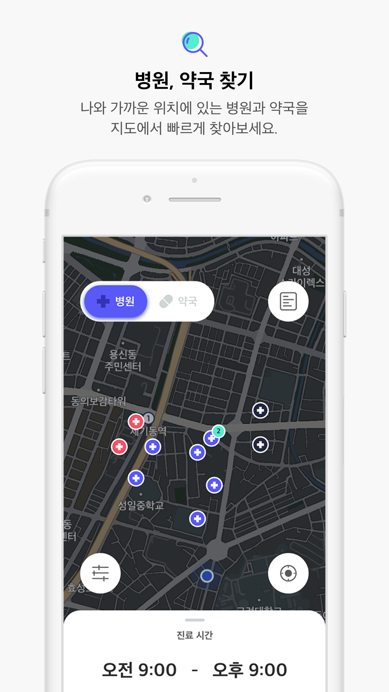
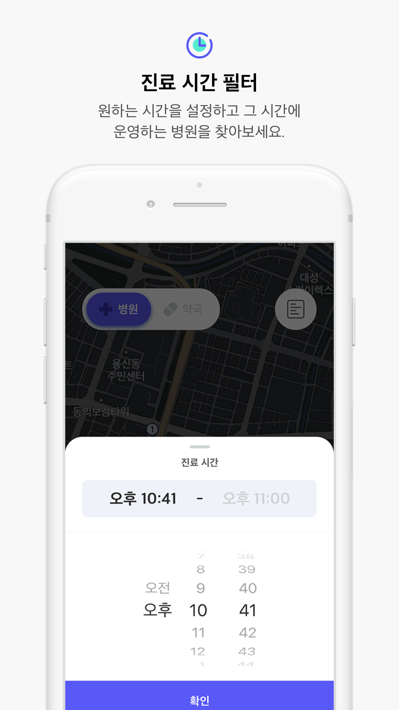
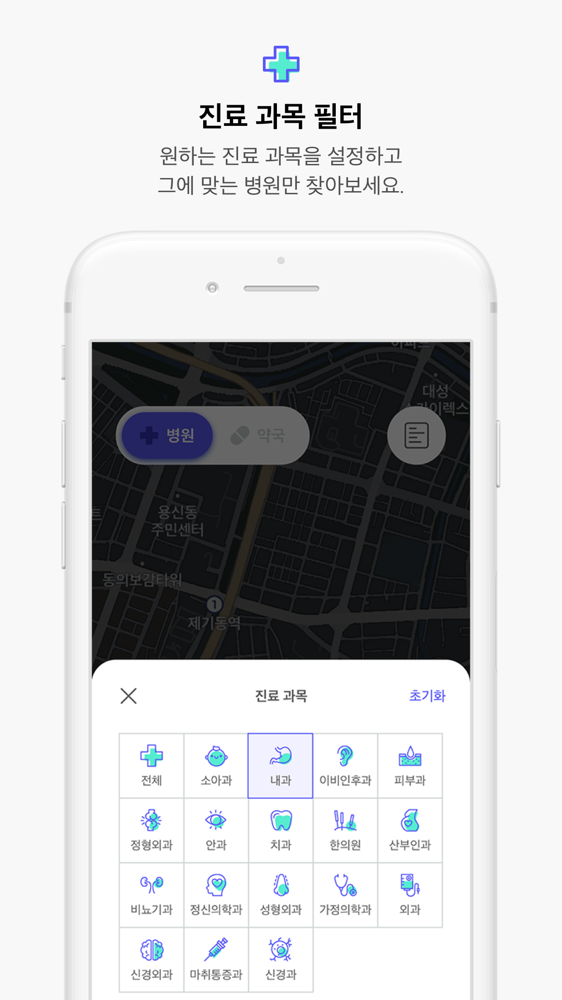
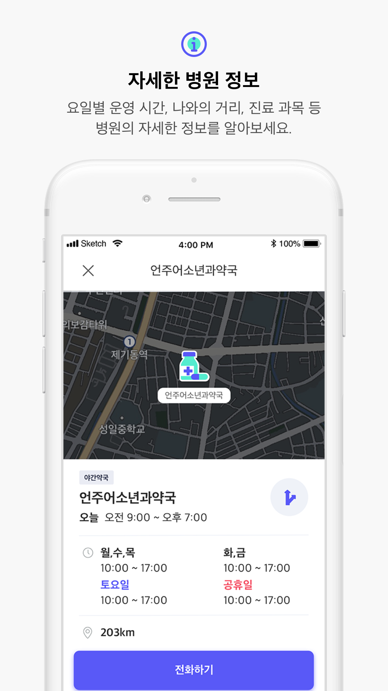
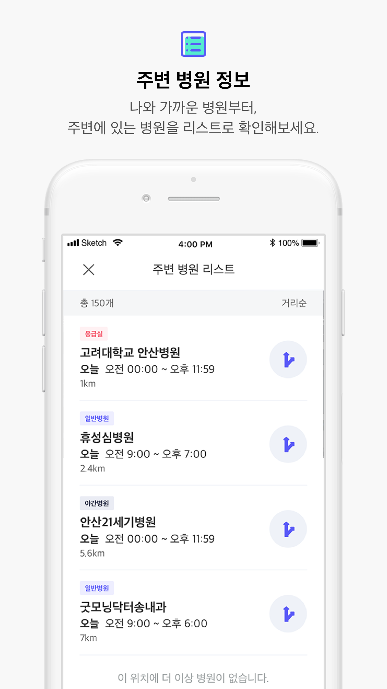
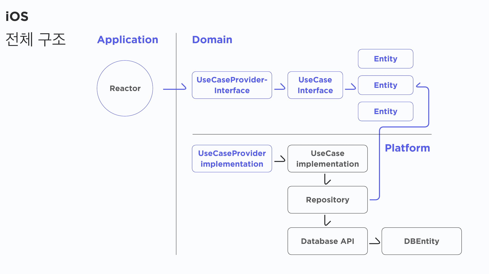

# 토닥토닥
[App store](https://itunes.apple.com/kr/app/tiptap/id1439433799?mt=8)

 **Todoc is provides searching hospitals and pharmacies nearby.**  

 

  

    

## Concept

 

## Requirements
- Xcode 11.3
- Swift 5
- iOS 12.0

## Reference
#### Architecture
- Clean Architecture
- ReactorKit

#### UI
- SnapKit

#### Reactive
- RxSwift
- RxCocoa

#### Network
- Alamofire
